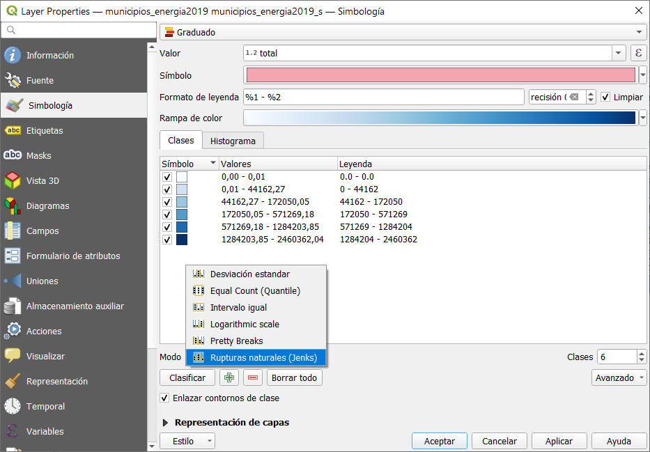
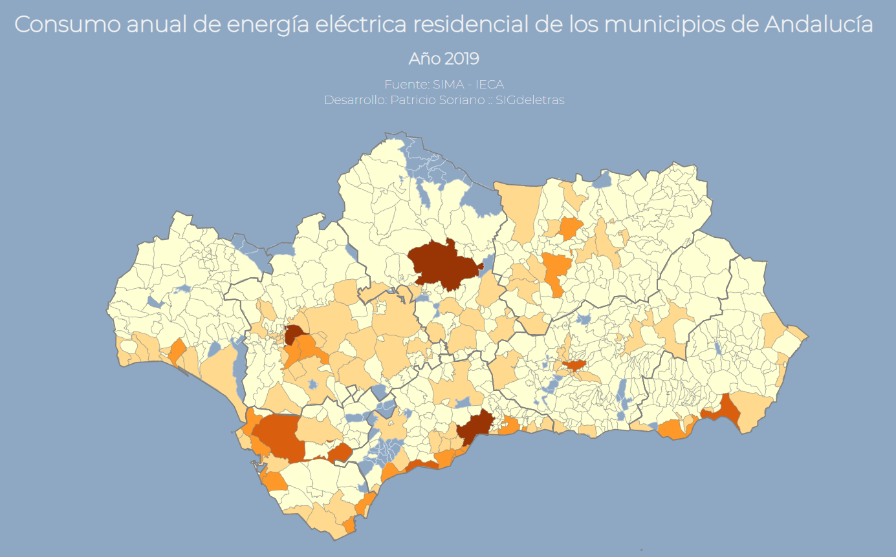

# Entrada 2

Vamos a continuar con la serie de entradas dedicadas a la creación visualizaciones web de datos espaciales con la librería D3. En la primera de ellas vimos [cómo crear una estructura básica de ficheros para nuestra página y añadimos de archivos GeoJSON con D3](http://sigdeletras.com/2021/desarrollo-web-de-visor-de-mapas-con-la-libreria-d3/).

Ahora toca usar los atributos de las capas que almacenan el consumo anual de energía eléctrica por municipios de Andalucía en 2019. La información procede del [Sistema de Información Multiterritorial de Andalucía](https://www.juntadeandalucia.es/institutodeestadisticaycartografia/badea/informe/anual?CodOper=b3_151&idNode=23204) del IECA. Mi objetivo es **crear un mapa donde quede reflejado en agrupaciones que reflejen áreas, en este caso municipios, con un consumo energético anual similar**.

Dentro del ámbito del dieño cartográfico este tipo de representaciones se denomina **mapa de coropletas**, es decir un mapas temático que representan una variable estadística.

Para este tipo de representaciones es importante elegir correctamente el método que vamos a usar para clasificar los datos. Los **métodos intervalo manual, intervalo definido, equivalente, basado en cuantiles, rupturas naturales de Jenks o desviación estándar**. La mayoría de los Sistemas de Información Geográfica cuenta con opciones para ello.



Usaremos el método de **rupturas naturales** creado por el cartógrafo George F. Jenks. En esta clasificación lass clases se crean de manera que los valores similares se agrupan mejor y se maximizan las diferencias entre las clases. Las rupturas marcan diferencias considerables entre los valores de los datos.

## Creando un esquemas de color con D3

Para crear nuestro mapa temático con D3 usamos las escalas. Gracias a este tipo de objetos podremos representar una dimensión de datos abstractos en una representación visual (píxeles). Los valores estarán definidos por un dominio (domain) que es usado como elemento de entrada. Los datos de salida, o representación visual se hace mediante un rango (range). 

Para nuestro proyecto definimos un tipo de escala basada en límites o umbrales (scaleThreshold). El dominio serán los valores de las ruturas naturales, obtenidas con QGIS. Y para el el rango, usaremos las esquemas cromáticas de D3 definiendo a partir de 7 clases.

```javascript
//main.js
...
const colorScale = d3
  .scaleThreshold()
  .domain([0.1, 45000, 175000, 575000, 130, 1300000, 2500000])
  .range(d3.schemeBlues[7]);
...
```

Para aplicar nuestra escala definida en la variable *colorScale* cambiaremos el atributo de relleno de
del path de municipios por una función que aplique el valor de la variable para cada dato del total de consumo.

Hemos mejorado el resultado a nivel visual añadiendo un color gris a la delimitación de los municipios.

```javascript
//main.js
...
Promise.all([municipios, provincias]).then((data) => {
  svg
    .append("g")
    .selectAll("path")
    .data(data[0].features)
    .join("path")
    .attr("class", "municipality")
    .attr("d", geopath)
    .attr("stroke", "#C0C0C0")
    .attr("stroke-width", "0.2px")
    .attr("fill", (d) => {
      return colorScale(d.properties.total);
    })
    .append("title")
    .text((d) => {
      return d.properties.total;
    });
...
```


Gracias a estos cambios ya podemos obtener los primeros análisis de los datos. Vemos que los nunicipios con consumos más elevados son las capitales de Málaga y Sevilla. Tenemos otra categoría con capitales de provincia (Córdoba, Huelva y Granada) y municipios residenciales como Jérez, Marbella o Alcalá de Guadaíra. Se unen a este grupo San Roque, Los Barrios y Palos de la Frontera, importantes polos industriales vinculados con la industria química, petrolera y energética por lo que tienen consumos altos en este sector.

Como vemos, el valor de un mapa correctamente simbolizado es realmente alto y su análisis puede ayudarnos correctamente a comprender y analizar las variables representadas. 

## Información adicional mediante etiquetas

Mejorado el aspecto visual, podemos completar la información ofrecida al visuario mediante etiquetas.

Lo primero que haremos es crear una función para que mejore el valor numérico del total. La función redondea a dos decimales y añade comas para difenciar los millares.

```javascript
//main.js
...
function roundDecimal(number) {
  const castString = parseFloat(number).toFixed(2);
  return Intl.NumberFormat("es-ES").format(castString);
}
```

Y para finalizar, vamos a usarla como valor de *title* para añadiendo el nombre del municipio y la unidad de medida (Megavatios/hora).

```javascript
//main.js
...
Promise.all([municipios, provincias]).then((data) => {
  svg
    .append("g")
    .selectAll("path")
    .data(data[0].features)
    .join("path")
    .attr("class", "municipality")
    .attr("d", geopath)
    .attr("stroke", "#808080")
    .attr("stroke-width", "0.1px")
    .attr("fill", (d) => {
      return colorScale(d.properties.total);
    })
    .append("title")
    .text((d) => {
      let infoTitle = `${d.properties.municipio} ${roundDecimal(
        d.properties.total
      )} Mwh`;
      return infoTitle;
    });
```
------------------------------------------------
Este sería el resultado final con los nuevos cambios y modificaciones


# Próximos pasos

Queda yo poco para terminar nuestro proyecto. Espero poder dedicarle un tiempo para mejorar los datos ofrecidos al usuario y poder añadir algún recurso más usando D3.

# Recursos

- Repositorio GitHub [https://github.com/sigdeletras/d3-energy-map/](https://github.com/sigdeletras/d3-energy-map/)
- Página del ["Visor de consumo anual de energía eléctrica de los municipios de Andalucía 2019 v2"](http://sigdeletras.com/d3-energy-map/public/v2/index.html)
