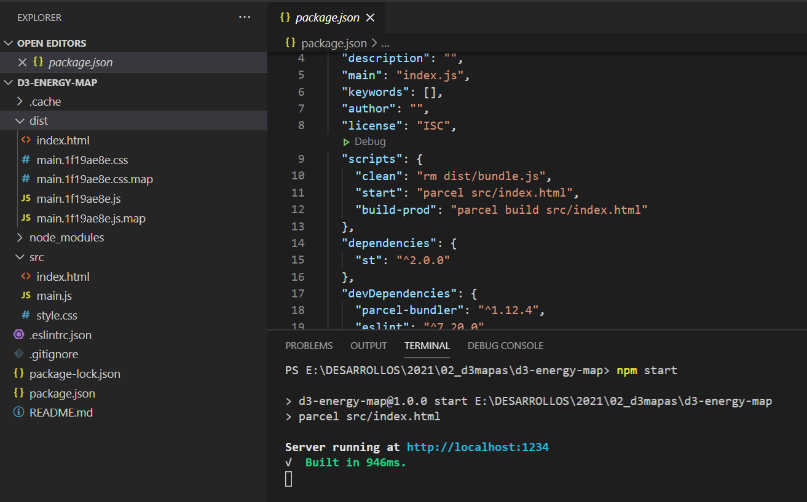
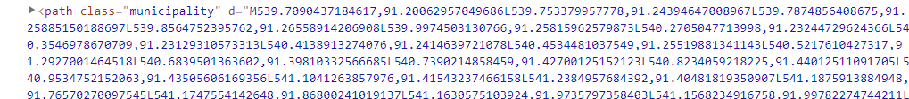
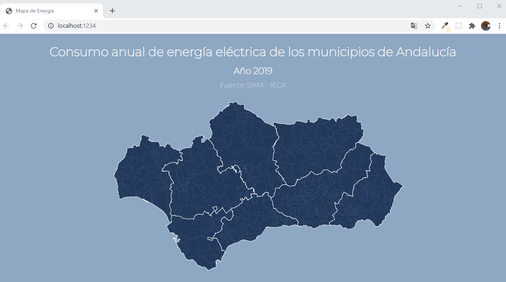

# Entrada 1

Hace unas semanas comenté en una entrada mi experiencia colaboración en un proyecto de código abierto cuyo objetivo era la consulta de la evolución del proceso de vacunación contre el COVID-19 en España. La aplicación desarrollada por Migul Durán cuenta un mapa que indica el porcentaje del vacuación por provincias.

Mi primera idea era contribuir en la mejora de este mapa pero surgieron un par de temas me hicieron cambiar de opinición. En primer lugar, encontré que el apartado de descarga de los datos no funcionaba correctamente. Y por otro lado, al consultar el código comprobé con sorpresa que el mapa estaba hecho con la librería Javascript D3 de la que soy un total desconocido.

Esto último, me ha impulsado a dedicarle un tiempo a estudiar y probar las opciones de esta biblioteca que si bien está pensada para producir a partir de datos gráficas estadísticas e infrografías muy potentes, permite representar datos geográficos.

## D3.js y mapas

La biblioteca está pensanda para crear objetos de tipo SVG, dentro de elementos HTML a los que se les puede aplicar estilo usando CSS. D3 incorpora un conjuntos de funciones Javascript predefinidas que permite selecionar elementos del DOM, agregar datos, crear transiciones o añadir efectos dinámicos.

[IMG]

Con D3 podemos añadir datos en distintos formatos como JSON, CSV, TopoJSON y geoJSON. Este aspecto lo hace realmente potente ya que si pensamos en la presentación de mapas nos va a permitir trabajar con datos en geoJSON, el formato más común dentro para aplicaciones de mapas en web.

Destaca igualmente, la capacidad de trabajar con múltiples tipos de proyecciones cartográficas (cónica, cilíndrica, mercator o acimutal) y aplicar elegir el tipo de deformación (equidistante, equivalente o conforme). Esta potencia será de gran utilidad para representar con datos a escala muncial o de pais.

[IMG]

Para completar la visión de D3 en uso en el campo de la información espacial añadir las opciones para crear mapas temáticos basados en categorías o clasificaciones (mapas coropléticos) e incluir esquemas de color y leyendas.

[IMG]

## Dificultad

Como primera priedra en el camino, debemos tener en cuenta que D3 trabaja con [Gráficos Vectoriales Escalables (del inglés Scalable Vector Graphics) o SVG](https://developer.mozilla.org/en-US/docs/Web/SVG), y que estos son formato en  lenguaje XML. Esto requiere tener ua conocimiento base sobre lenguaje de marcado, los tipo de elementos gráficos de SVG y el trabajo con atributos.

Si pensamos que D3 que la programación de datos en mapas se parece algo a las libreráis Javascript más conocidas como Leaflet u Openlayer vamos por mal camino. D3 trabaja preferente con selectores al estilo de CSS y aplica operadores de forma pareceda a JQuery para la maniculación de elementos del DOM.

Otra difultad que me he encontrado es la documentación. Hay muchísimos ejemplos para diseño de gráficos e infografías, pero no tantos para diseño de mapas. Además, según he podido comprobar hubo [cambios entre versiones](https://github.com/d3/d3/blob/master/CHANGES.md) en la denominacion de las funciones, por lo que hay estar muy atento a la versión de la [API](https://github.com/d3/d3/blob/master/API.md) que se usa en cada ejemplo.

Como recurso prinicpal está la propia [galería de ejemplos la web de D3](https://observablehq.com/@d3/gallery) con un apartado dedicado a mpas. Existe también muchos recursos de D3 en https://bl.ocks.org/

## Un ejemplo "Mapa de consumo de energía de municipios de Andalucía"

Sin duda la mejor forma de aprender una librería es picando código. Voy a una serie de entradas el código y los recursos usados para hacer un mapa de coropletas que represente el consumo de energía de los municipios de Andalucía en el año 2019. 

Los requisitos de la aplicación son los siguientes:

- Debe tener un título y una cita a la fuente de la información
- El mapa debe representar el consumo total de energía de cada municipio.
- Al poner el cursor sobre el municipio se mostrará infomación del consumo por sectores.

Los datos de consumo y la capa de municipios provienen del Instituto de Estadística y Cartografía de Andalucía. Una vez descargados, he usado QGIS para crear un geoJSON con la unión de ambos conjuntos de información por su código INE. Para bajar de peso, también he simplificado las geometrías.

## Estructura del proyecto

Como cualquier librería JavaScript, D3 puede ser añadida directamente desde m d3js.org, CDNJS o unpkg.

```html
<script src="https://d3js.org/d3.v6.js"></script>
```

Pero ya que nuestro proyecto usará Node y el empaquedador de aplicaciones Parcel, 
he usado ["Create App"](https://createapp.dev/) para un archivo zip con los recursos m
mínimos como para comenzar una aplicación *front-end*.


Descomprimido el archivo, realizaremos la correspondiente instalación con *npm install* .

Podemos instalar módulos D3 de forma independiente. Por ejemplo, el módulo para manejo de datos geográficos y proyecciones es d3-geo. Estoy es muy positivo ya que tras empaquetar la aplicación su peso sería menor. Pero como estamos desarrollando a modo de pruebas y en local, realizamos la instalación de la biblioteca completa para tener disponibles todas sus funciones.

```
npm install d3
```

## Archivos HTML y CSS

En *src/index.html* crearemos la estructura básica mediente cajas (div) a las que añadiremos clases CSS. Vamos añadiendo reglas con *style.css* y añadimos el archivo en el fichero *main.js*.

La aplicación cuenta ya con el script *npm start* que levanta un servidor de desarrollo integrado. Con este comando, Parcel construye nuestra aplicación añadiendo en la carpeta */dist* todos los archivos necesarios.



El resultado es el siguiente:


 
## Añadiendo archivo un GeoJSON con D3

Ya tenemos todo preparado para añadir nuestra información geográfica usando D3. Lo primero es importar la librería D3 dentro del archivo *main.js*. Importamos también el archivo geojson que hemos alamacenado en la carpeta *src/data*.

```javascript
// main.js
import "./style.css";
import * as d3 from "d3";
import municipiosandalucia from "./data/municipios_energia2019.geojson";

```

Seleccionamos el elmento HTML, en este caso el div con el id *map* y añadimos el objeto SVG dándole un tamaño mediante el atributo [viewBox](https://developer.mozilla.org/en-US/docs/Web/SVG/Attribute/viewBox) añadiendo las variables de anchura y altura.

```javascript
// main.js
...
const width = 1000;
const height = 350;

const svg = d3
  .select("div#map")
  .append("svg")
  .attr("viewBox", [0, 0, width, height]);

```
Como comentamos, trabjaremos con proyecciones geográficas para poder presentar el geoJSON. Gracias a estas funciones podremos representar datos en un plano.  En la variable *projection* almacenamos el tipo de proyección que vamos a usar, definimos escala, las coordenadas del centro y translación.

```javascript
// main.js
...
const projection = d3
  .geoMercator()
  .scale(5500)
  .center([-4.556, 37.333])
  .translate([width / 2, height / 2]);
```
Vamos a continuación a crear un elemento SVG de forma compleja ([path](https://developer.mozilla.org/en-US/docs/Web/SVG/Tutorial/Paths)). Pero como nuestros datos son geográficos, el elemento será un *geoPath* al que pasamos la proyección definida anteriormente.

```javascript
// main.js
...
const geopath = d3.geoPath(projection);
```



La función *d3.json()* se utiliza para recuperar el archivo geoJSON.

```javascript
// main.js
...
const municipios = d3.json(municipiosandalucia);
```

Para terminar, añadimos al SVG los datos usando una llamada asíncrona.

```javascript
// main.js
...
municipios.then((data) => {
  svg
    .selectAll("path") //Seleccionamos todos los elementos path
    .data(data.features) // Definimos el conjunto de datos con los elementos seleccionados
    .join("path") // Vinculamos los datos al elemento
    .attr("d", geopath) // Añadimos el atributo d con los datos de la ruta
    .attr("class", "municipality") // Añadimos una clase
    .attr("fill", "#23395b") // Asignamos un color de relleno
    .append("title") // Etiquetado sencillo que muestra el total del consumo
    .text((d) => {
      return d.properties.total;
    });
});
```
Podemos ir añadiendo elementos al SVG. En las siguientes líneas superponemos una segunda capa con los límites de las provincias andaluzas, en este usando el método [Promise.all](https://developer.mozilla.org/es/docs/Web/JavaScript/Referencia/Objetos_globales/Promise/all) y pasando un objeto (array) de con el nombre de las capas para que el método itere sobre él.

```javascript
// main.js
...
const municipios = d3.json(municipiosandalucia);
const provincias = d3.json(provinces);

Promise.all([municipios, provincias]).then((data) => {
  svg
    .selectAll("path")
    .data(data[0].features)
    .attr("class", "municipality")
    .attr("d", geopath)
    .attr("fill", "#23395b")
    .append("title")
    .text((d) => {
      return d.properties.total;
    });
  svg
    .selectAll("path")
    .data(data[1].features)
    .attr("class", "provinces")
    .attr("d", geopath)
    .attr("fill", "none")
    .attr("stroke", "#FFF")
    .attr("stroke-width", "0.7px");
});
```
